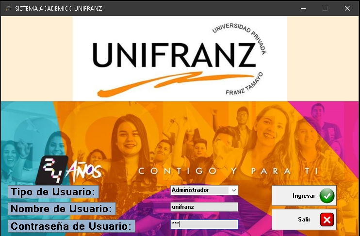
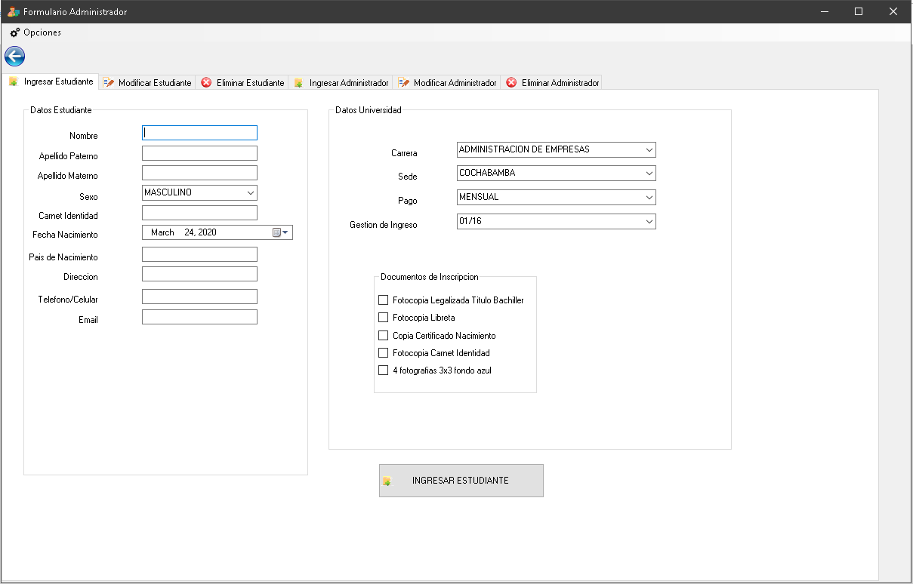
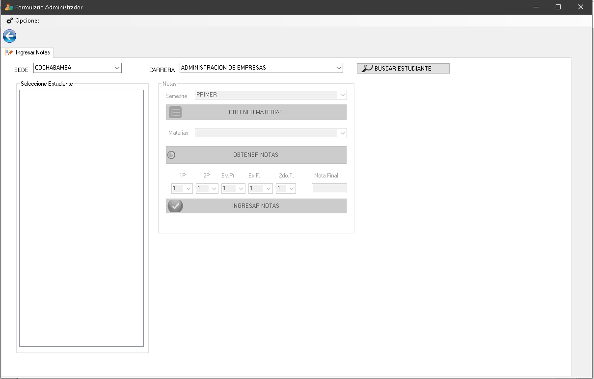
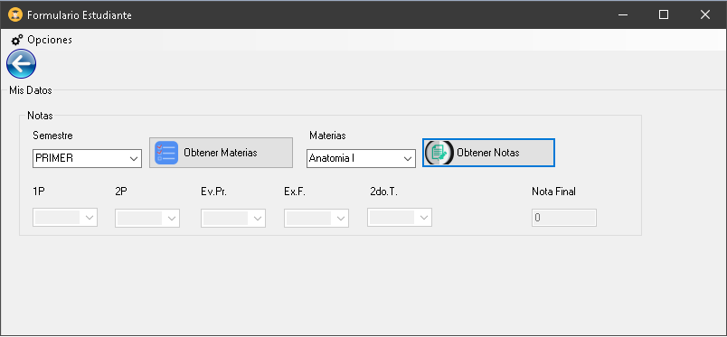

# 🎓University System - Unifranz📚

> Student data and grading system.

## Features

- C# Windows Forms
- SQL Server CRUD

---

## Screenshots

- Admin Panel

- Student Panel

---

## License

- **[MIT license](http://opensource.org/licenses/mit-license.php)**
- Copyright 2020 © <a href="https://github.com/teafoot" target="_blank">teafoot</a>